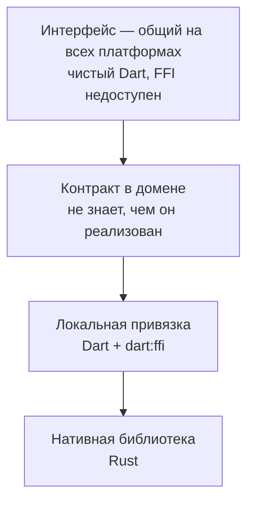

# QUIC и WebTransport — устройство

**Состояние: замысел.** Версия 0.0.1 занимает имя и проверяет конвейер
публикации; описанного ниже в коде пока нет. Документ существует, чтобы
реализация сверялась с ним, а не изобреталась заново.

## Где проходит граница

Правило, из которого всё следует: **в браузере `dart:ffi` не существует**.
Значит нативный код живёт строго ниже контракта, а интерфейс не знает о нём
ничего и продолжает собираться под web.

## Почему нативная библиотека, а не Dart

В Dart нет своей реализации QUIC, и оба запроса в трекере SDK закрыты со статусом «не планируется» (2015 и 2019). Значит выбор не между «на Dart» и «нативно», а между «нативно» и «никак». WebTransport сверх того требует HTTP/3, то есть сервер обязан говорить по QUIC — а серверная сторона у нас на Dart.

## Что обязано быть верно в реализации

- Отказ библиотеки не может обрушить процесс: ошибка возвращается значением,
  а не исключением из чужого стека.
- Ни один вызов не блокирует поток пользовательского интерфейса.
- Всё, что выделено в нативной части, освобождается детерминированно —
  сборщик мусора Dart о ней ничего не знает.
- Перечисления пересекают границу **по имени**, никогда по номеру: номер меняет
  смысл в тот момент, когда в середину списка добавляют случай.
